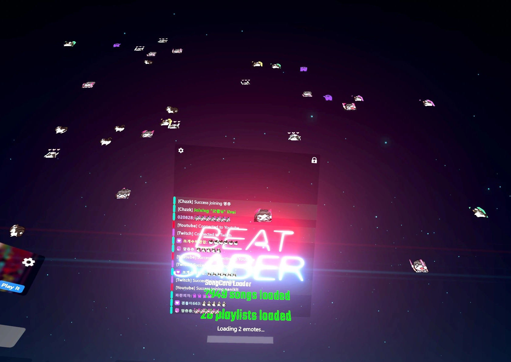

# ChatPlex.Chzzk

[BeatSaberPlus](https://github.com/hardcpp/BeatSaberPlus) Chat 플러그인 치지직 연동 모드입니다.



## 설치

1. Beat Saber 1.39.1+, BeatSaberPlus 모드를 준비합니다.
2. [최신 버전 zip](https://github.com/nanikit/ChatPlex.Chzzk/releases)을 받아 게임 폴더에 압축 해제합니다.
3. 게임 실행 후 게임 폴더에 `UserData/ChatPlex.Chzzk.json` 설정 파일이 생깁니다.
4. 설정 파일에 치지직 채널 URL(`https://chzzk.naver.com/<채널 ID>`)에서 확인 가능한 채널 ID를 입력합니다.

```json
{
  "ChannelId": "e977288b0ee6a75de8bc792945a814fa"
}
```

## 빌드

```bash
dotnet build -c Release
```

Beat Saber DLL 참조 필요:

- `../Refs` 디렉토리에 Beat Saber 설치 폴더 내용 복사, 또는
- `BeatSaberDir` 환경 변수에 Beat Saber 설치 경로 설정
